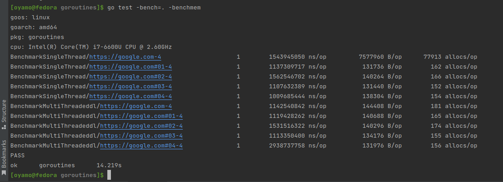

# Buffered Channels Golang

`go 1.19`

This is implementation of lightweight threads (Goroutines) in Golang. The scripts download webpages concurrently and saves them to a text file. A benchmark is carried out to  determine the performance when using goroutines and when not.
## Benchmark Screenshot

## Benchmarking
```shell
go test -bench=.
```

## Building

```bash
make
```

## Cleaning

```bash
make clean
```